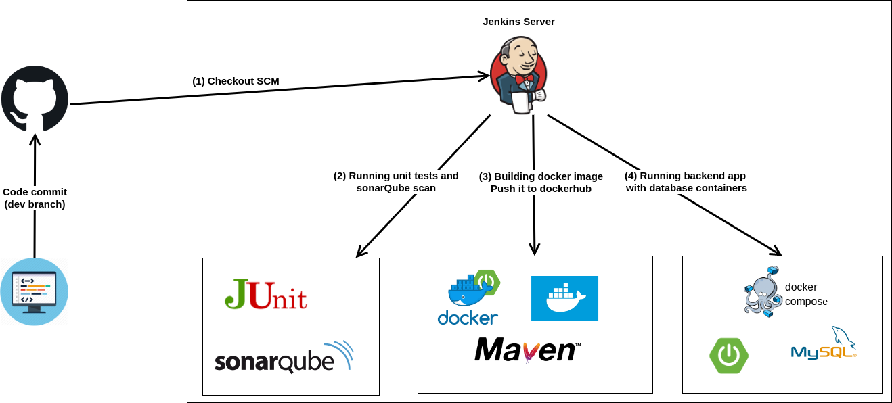
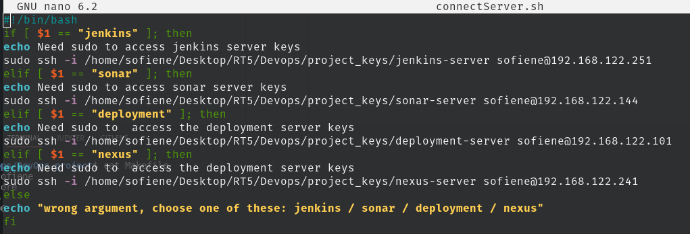
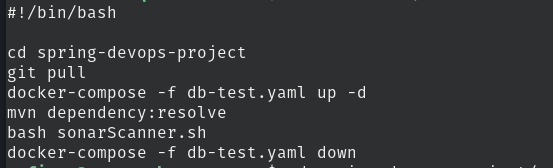
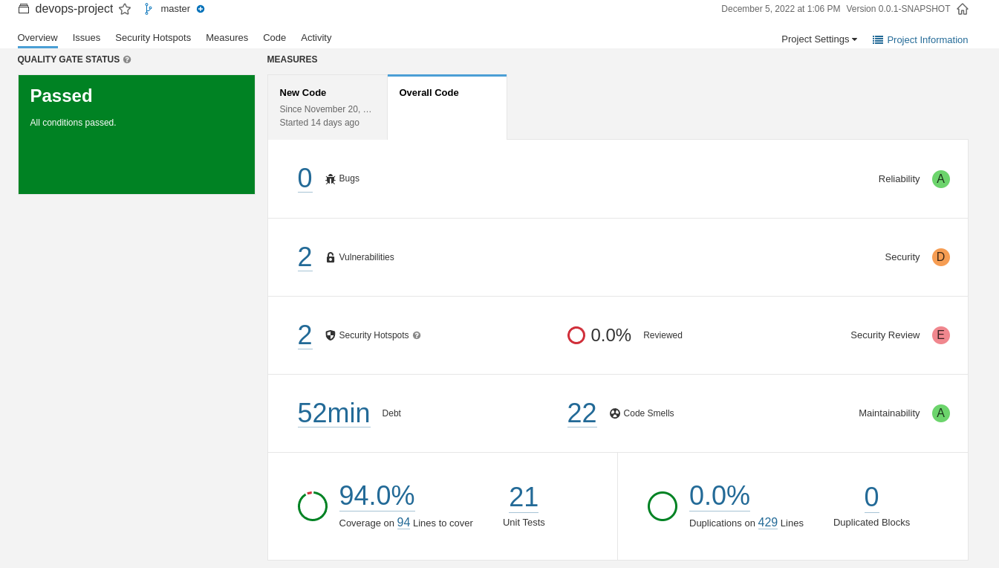
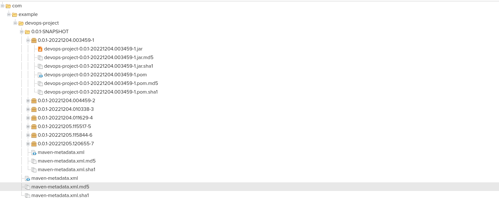
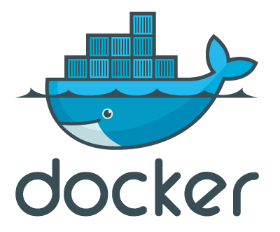
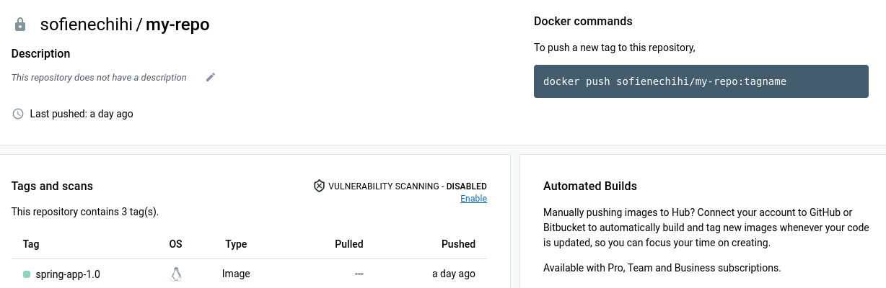
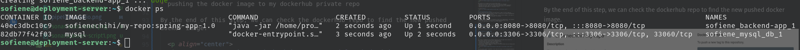
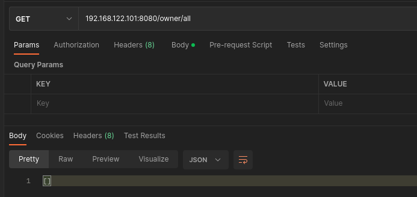

# Spring Devops project
## Description of the project

This project is created to test the process of a **CI/CD pipeline** using **Jenkins**.

We don't really care about the content of the application more than about the process that our application will go through.
Our application is a simple pet store where we have the owners and their pets.

<p align="center">
  
</p>

The process of our pipeline will follow these steps : 
* Running the unit tests and scanning the code using the sonarQube
* Building an artifact (JAR in our case) and pushing it to a Nexus repository
* Building the docker image for our application and pushing it to dockerhub
* Deploying the application in a deployment server 

<p align="center">
  
</p>

## Test the application locally
* First thing to do after cloning the application is open it with an IDE and specifying that it's a maven project in order to check for the required dependencies ( used packages ) in the POM.xml file.
* Launch mysql database in a docker container using the make command ( only need to have docker and docker-compose available ) by running 
```
make run_db
```
* Once the database container is launched, we can run our application ( the database configuration for our app can be found in application.properties file)
* To run the application unit tests, we run the command
```
mvn test
```
## Pipeline steps
For that purpose, I used 4 VMs running ubuntu server and generated the SSH keys to connect to each one of them.
To facilitate the connection to each server, I used the following bash script
<p align="center">
  
</p>

### Code analysis with sonarQube

In this step, I configured a sonar-server in order to run sonarQube container with postgres and pgAdmin containers for the database.
I create the required volumes to save the sonarQube data, logs and extensions.
<p align="center">
  
</p>

This step is triggered by the jenkins pipeline using ssh agent that connects to sonar-server and runs the bash script responsible for 
* running pulling the source code in the master branch
* starting a test database using docker compose
* resolving the dependencies and running the unit tests
* running sonar scanner command that anayses the code and takes the unit testing scan results thanks to jacoco plugin.
<p align="center">
  
</p>

Once the sonar scanner completed, we can check the result in the sonarqube dashboard
<p align="center">
  
</p>


### Pushing JAR to Nexus repository

<p align="center">
  
</p>

This step is quite simple, all that need to be done is:
* running nexus in a server 
* adding the nexus plugin and configuration to POM.xml file in our project
* configuring the nexus user credentials in our jenkins container under .m2 directory
* running ```mvn clean deploy```
  
And then Nexus saves all the snapshots under maven-snapshots repository (configured in POM.xml)

<p align="center">
  
</p>

### Building docker image and push it to dockerhub

<p align="center">
  
</p>

In this step, we're :
* building a docker image for our project using Dockerfile
* accessing my dockerhub account using the credentials set in jenkins
* pushing the docker image to my dockerhub private repo

By the end of this step, we can check the dockerhub repo to find the new pushed docker image.

<p align="center">
  
</p>


### Deploying the application on the deployment server

To make the deployment easy, I created a docker-compose.yml file that runs the dockerized application with mysql database.

Since the deployment environment can have his specific env variables, we're :

* exporting the needed env variables for docker-compose into the server
* running docker-compose file that will pull the docker image from the private dockerhub repo and run it with the database container

We can check that our containers are running in the deployment server using ```docker ps```
<p align="center">
  
</p>

And by testing a simple GET request to retrieve the owners in our database
<p align="center">
  
</p>